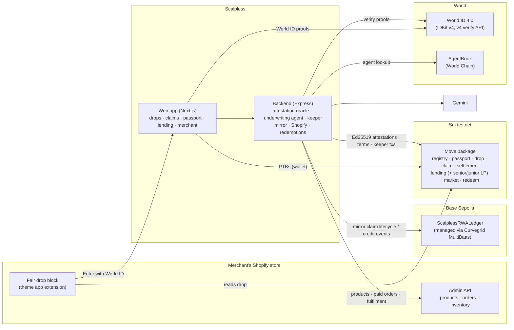

# Scalpless — fair drops for Shopify

**One human, one fair chance.** Scalpless is a Shopify plugin and on-chain protocol for hype
launches: every buyer is a World ID-verified unique human, winners are drawn with Sui's on-chain
randomness, each win is a tokenized claim on a real unit of the merchant's inventory, and people who
can't pay upfront can finance it with an uncollateralized loan backed by their own identity.

---

## The problem

### 1. Bots empty the shelves before humans can click

When demand spikes — a PS5 Pro in the run-up to GTA 6, a limited GPU, concert or family-event
tickets — automated agents sweep the inventory in seconds. They run thousands of accounts, solve
checkouts faster than any person, and relist everything at a markup. Real fans see "sold out", the
merchant's brand eats the anger, and the profit goes to resellers.

### 2. Merchants have no real way to stop it

A merchant on Shopify who wants a fair launch has few options that work. CAPTCHAs, queue pages,
purchase limits and raffle apps are all keyed to things bots can mint for free — emails, accounts,
cards, IP addresses — so one operator still enters a thousand times. There's no single place a
merchant can plug in and say "one entry per real person", and no way to keep control of the resale
market once the item has shipped.

### 3. Many buyers can't pay upfront, and crypto credit doesn't help them

Even a buyer who wins may not have the full price on the day. Traditional credit shuts out a lot of
people — the World Bank's Global Findex 2025 counts **1.3 billion adults without a bank account** —
and crypto lending is almost entirely **over-collateralized**: you must lock up more value than you
borrow, which is useless to someone who doesn't already have the money. The people most exposed to
scalper pricing are exactly the ones with no way to finance a fair-price purchase.

## What Scalpless does

| Problem | Scalpless |
|---|---|
| Bots and multi-accounting | **World ID 4.0**: one uniqueness proof per human (World itself refuses a second), so one person = one Credit Passport = one entry per drop, on any wallet. |
| Unfair allocation | **Three-round weighted draw on Sui** using `sui::random`; higher-assurance credentials (Orb > passport > selfie) get more tickets; losers are refunded in the draw transaction and form a random waitlist. |
| Resale scalping | The win is a **key-only Sui object**: it can't be transferred to a bot or listed on an outside marketplace. Resale happens only in the Scalpless market, **capped at 110% of face value**, to another verified human (one resale per human per drop). |
| No way to pay | **Borrow on yourself**: an uncollateralized loan backed by the buyer's World ID passport, or **zero-default layaway**. |
| Merchant tooling | A **Shopify app**: a product-page block, drop launch from the merchant's own catalog, and redeemed wins arrive as paid Shopify orders. |

## The Shopify plugin

Scalpless is built to drop into any Shopify store as an app.

- **Fair drop block** (theme app extension, `apps/shopify-app`). Added to the product template in
  the theme editor, it shows the live drop for that product — verified entries, units, the World ID
  level required, a countdown — read straight from Sui in the shopper's browser. On fair-drop products
  it replaces *Add to cart* and *Buy it now* with "Add to cart unavailable · fair drop item", so a
  checkout bot has nothing to hit. The **Enter with World ID** button takes the shopper to Scalpless.
- **Launch from your catalog.** In the Scalpless merchant tab the merchant picks a Shopify product,
  sets units and timings, and launches the drop: the Sui drop is created, the product is tagged and
  added to a **Drops** collection and menu, and the block appears on its page. New products (photos,
  price, stock) can also be created from Scalpless and launched in one step.
- **Redeem → order → ship.** A winner who has paid redeems the claim with a shipping address; the claim
  is burned on Sui and a **paid Shopify order** for that variant is created (inventory decremented).
  When the merchant fulfils it in Shopify admin, the buyer sees *Shipped* with tracking.
- **Every unit on a public ledger.** Each claim's lifecycle — won, paid / layaway / financed, resold,
  redeemed, shipped — is recorded through **Curvegrid MultiBaas** on an EVM ledger and shown in the
  merchant dashboard.

## Borrow on yourself: why uncollateralized works here

A lender can't seize anything from a borrower who put nothing up. What Scalpless has instead is
**identity that can't be reset**:

- A World ID uniqueness proof can be made **once per human**. A borrower who walks away can't make a
  new passport, and switching wallets doesn't help — the passport is keyed to the human, not the wallet.
- A default **locks the human out of Scalpless everywhere**: no more loans and **no more fair drops**.
  For people who use Scalpless to get launch-day items at face price, that is a real cost.
- Credit is **earned**: limits start small and grow with each on-time repayment or completed layaway.
- **Resale proceeds repay the loan first**, before the seller sees anything.
- Lenders choose their risk: a **junior tranche** takes losses first in exchange for most of the fees.

### Fees and parameters

| Item | Rule |
|---|---|
| Entry deposit | 10% of face price, refunded to everyone who doesn't win (applied to the price for winners) |
| Resale cap | 110% of face value, enforced on-chain |
| Layaway | 25% now (deposit counts toward it) + 3 equal installments; completing it raises the credit limit; a missed installment refunds 95% (5% to the seller) and passes the claim to the waitlist — the buyer is never in debt |
| Starting credit limit | Orb-verified 1 SUI · passport 0.5 SUI · selfie 0 |
| Limit growth | +0.5 SUI per loan repaid on time · +0.25 SUI per completed layaway |
| Loan fee (for the whole term) | Policy: Orb 5%, passport 8%; +4% while marked late; −1% per past on-time repayment; floor 2%, cap 30%. The AI underwriter may only **tighten** these terms. |
| Repayment | 4 equal installments over the term; anyone may repay for the borrower; resale proceeds and layaway refunds are applied first |
| Fee split to lenders | 40% senior tranche · 60% junior tranche (junior absorbs defaults first) |
| Late / default | After a missed installment + grace anyone can mark the loan late; after term + grace anyone can default it: the junior tranche absorbs the loss and the human is locked out |

The fees pay lenders for the risk of lending without collateral; the junior tranche earns most of them
because it takes the first loss. (Demo pool on testnet: 10-minute term, 2-minute grace, so the whole
cycle can be shown live.)

## How a drop works

**Shopper**
1. Opens a fair-drop product in the store and taps **Enter with World ID**.
2. First time: verifies with World App (a session proof plus a one-time uniqueness proof) and mints
   a Credit Passport on Sui.
3. Enters the drop with a 10% refundable deposit.
4. When entries close, anyone can run the draw; winners get a claim, everyone else is refunded.
5. The winner re-confirms with World ID (so a bot that farmed a win can't claim it), then pays in
   full, starts a layaway, or borrows on themselves.
6. Redeems for delivery → a paid Shopify order → shipped. Or resells at up to 110%.

**Merchant**
1. Installs the app, adds the **Scalpless fair drop** block to the product template.
2. Launches a drop from a Shopify product (or creates the product from Scalpless).
3. Watches verified demand, winners and each unit's lifecycle in the dashboard.
4. Fulfils redeemed orders in Shopify as usual.

**AI agents**
- **Underwriting agent** (Gemini) reads the borrower's on-chain passport and their credit history
  indexed by MultiBaas, proposes terms within the policy, and writes them on-chain.
- **Keeper agent** enforces repayment schedules on-chain when the contract's conditions are met and
  explains each action.
- **Shopping agents** (World ID for Agents / AgentKit): a person can pair an AgentBook-registered agent
  that enters drops for them. It can't claim wins — that still needs the human.

## Architecture



- **World ID → Sui.** Sui has no World ID verifier, so the backend verifies each proof with World's API
  and signs an Ed25519 attestation. On-chain, `registry::verify` returns an `Attested` hot potato
  that the protocol function must consume in the same transaction, for one action on one object.
- **Custody.** Claims are key-only; during layaway and resale the protocol holds them by
  transfer-to-object.
- **Lending.** One shared pool with `SENIOR_LP` / `JUNIOR_LP` coins, underwriter terms, installment
  repayment, an income router and permissionless enforcement. Invariant:
  `senior_assets + junior_assets == cash + outstanding_principal`.
- **RWA ledger.** A mirror follows Sui events and records each claim step and credit event on the
  EVM ledger through MultiBaas (built, signed by the operator, submitted and indexed by MultiBaas).

## Repository

```
apps/
  web/            Next.js app (Sui dApp Kit over gRPC, IDKit widgets)
  backend/        Express API: World ID, AgentKit, attestations, underwriting + keeper agents,
                  MultiBaas mirror, Shopify, redemptions
  shopify-app/    Shopify app config + "Scalpless fair drop" theme app extension
packages/
  sui-contracts/  Move package + 24 tests + testnet deployment record
  evm-contracts/  ScalplessRWALedger (Foundry, 5 tests) + Base Sepolia deployment
  shared/         BCS attestation payload shared by backend and Move tests
scripts/          deploy-sui, rotate-verifier, deploy-ledger, shopify-setup, agent CLI
docs/             WORLD_ID.md · SUI.md · CURVEGRID.md
```

## Deployments (testnet)

| | |
|---|---|
| Sui package (original / latest) | `0xe1494f19…a856` / `0x967fa893…9fb7` |
| Passport registry | `0x3cedfdc4…20c0` |
| Lending pool | `0x0e643d8d…2e8b` |
| Market | `0xce85bc3d…96c3` |
| RWA ledger (Base Sepolia, MultiBaas) | `0xA15b03D31F32c8Da244d972121DF6f1091c66110` |

Full ids: `packages/sui-contracts/deployments/testnet.json`, `packages/evm-contracts/deployments.base-sepolia.json`.

## Running it

Prerequisites: Node 18+, pnpm, the Sui CLI, Foundry, a Sui wallet on testnet, World App.

```bash
pnpm install
cp .env.example .env     # World ID app + RP, Sui deployer, MultiBaas, Gemini, Shopify
pnpm dev                 # backend :4000 + web :3000
```

| Task | Command |
|---|---|
| Move tests | `cd packages/sui-contracts && sui move test` |
| EVM ledger tests | `cd packages/evm-contracts && forge install foundry-rs/forge-std --no-git && forge test` |
| Deploy Sui package | `pnpm deploy:sui` |
| Deploy the ledger through MultiBaas | `pnpm deploy:ledger` |
| Deploy the Shopify app + extension | `pnpm shopify:deploy` |
| Storefront setup (Drops collection, menu) | `pnpm shopify:setup` |
| Agent CLI | `pnpm agent status \| link <CODE> \| me \| enter <DROP_ID> \| selftest` |

Details: [`docs/WORLD_ID.md`](docs/WORLD_ID.md), [`docs/SUI.md`](docs/SUI.md),
[`docs/CURVEGRID.md`](docs/CURVEGRID.md), builder feedback in [`FEEDBACK.md`](FEEDBACK.md).

## What's next

- **Public deployment** — host the web app and backend so anyone can verify on their own phone and
  enter the same draw (the app is currently run locally against public testnets).
- **Stable pricing** — settle drops, deposits and loans in a stablecoin on Sui instead of SUI, so the
  on-chain price matches the store's currency.
- **Public Shopify app** — OAuth install for any store and a listing in the Shopify App Store, instead
  of the single development store used today.
- **Notifications** — email and World App notifications for draw results, installments due and
  shipping.
- **Trust-minimized World ID on Sui** — verify World ID proofs on-chain (Groth16) instead of through the
  backend attestation oracle.
- **Durable backend storage** — move the verified-human registry, mirror state and redemptions from
  JSON files to a database.
- **Merchant resale royalties** — let merchants take a share of capped resales.
- **Mainnet** — after an audit of the Move package and the ledger.
